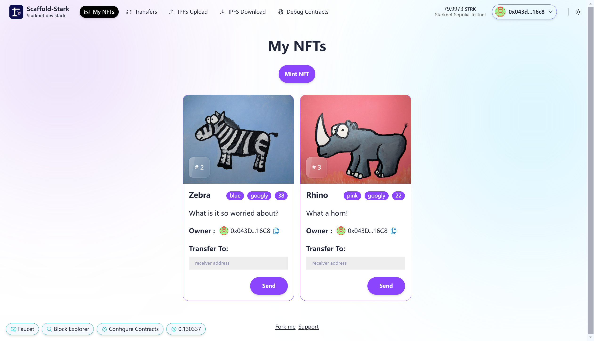
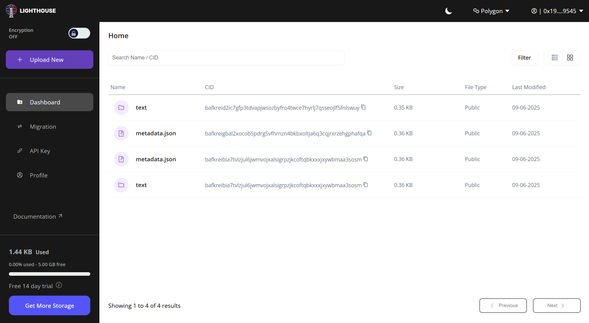

# 📜 Challenge #0: Simple NFT
**Code based on** [**Speedrunstark**](https://github.com/Scaffold-Stark/speedrunstark)
**(Powered by Scaffold-Stark)**



🔗 **前端交互链接** [**vercel.app**](https://starknet-simple-nft-sigma.vercel.app/)  

📜 **Starknet Sepolia 测试网 智能合约地址** [0x02e952d8f16c9d5b3ec3ae955293de9277c9cc4be9a5fd215229560678b1862e](https://sepolia.starkscan.co/contract/0x02e952d8f16c9D5b3Ec3ae955293de9277C9cc4bE9a5fd215229560678B1862E)

## Step 0: 📦 Env&Dependencies 环境和依赖 

- [Node (>= v20)](https://nodejs.org/en/download/)
- Yarn ([v1](https://classic.yarnpkg.com/en/docs/install/) or [v2+](https://yarnpkg.com/getting-started/install))
- [Git](https://git-scm.com/downloads)
- [Rust](https://rust-lang.org/tools/install)
- [asdf](https://asdf-vm.com/guide/getting-started.html)
> 
- [Cairo 1.0 extension for VSCode](https://marketplace.visualstudio.com/items?itemName=starkware.cairo1)
- [Starknet-devnet (=v0.4.0)](https://github.com/gianalarcon/asdf-starknet-devnet/blob/main/README.md)
- [scarb (=v2.11.4)](https://docs.swmansion.com/scarb/download.html#install-via-asdf)
- Starknet Foundry( [snforge v0.41.0](https://foundry-rs.github.io/starknet-foundry/getting-started/installation.html#installation-via-asdf) )

> ### Compatible versions
- Cairo - v2.11.4
- Rpc - v0.8.0
- Scarb - v2.11.4
- Snforge - v0.41.0
- Starknet-Devnet - v0.4.0

Make sure you have the compatible versions otherwise refer to [Scaffold-Stark Requirements](https://github.com/Scaffold-Stark/scaffold-stark-2?.tab=readme-ov-file#requirements)

### 完成依赖安装
```bash
git clone https://github.com/Scaffold-Stark/speedrunstark.git challenge-0-simple-nft
cd challenge-0-simple-nft
git checkout challenge-0-simple-nft
yarn install
```

## Step 1: 📜 Deploy Contract 合约部署 

### 自定义合约显示名（可选）
- 在packages/snfoundry/scripts-ts/deploy.ts，添加`contractName`
```ts
const deployScript = async (): Promise<void> => {
  await deployContract({
    contract: "YourCollectible",
    contractName: "Starknet NFT Dapp",//add new contract name here
    constructorArgs: {
      owner: deployer.address,
    },
  });
};
```
- 注意如下位置里的`contractName`若没有同步也须修改
```
packages/nextjs/components/SimpleNFT/NFTcard.tsx
packages/nextjs/components/SimpleNFT/MyHoldings.tsx
packages/nextjs/app/transfers/page.tsx
packages/nextjs/app/myNFTs/page.tsx
```

### 测试网部署（Sepolia ）

- 在 packages/snfoundry/.env 文件中，填写与 Sepolia 测试网相关的环境变量，包括您的钱包地址和私钥
    >  建议使用strarknet钱包如 Argent X，新建standard account进行测试网操作
    ```shell
    ## Sepolia 
    # Below input your testnet private key
    PRIVATE_KEY_SEPOLIA= 私钥
    # Below input the rpc url of the testnet network
    RPC_URL_SEPOLIA=https://starknet-sepolia.public.blastapi.io/rpc/v0_8
    # Below input your testnet account address
    ACCOUNT_ADDRESS_SEPOLIA= 钱包地址
    ``` 

> #### 完成部署
```bash
yarn deploy --network sepolia
```

> #### 报错处理

```
Error: The wallet you're using to deploy the contract is not deployed in the sepolia network.
```

<details><summary>解决方案</summary>

在钱包选择standard account 点击deploy account  进行部署


</details>

---

```
message: 'Account validation failed'
```
<details><summary>解决方案</summary>
检查选择的地址，不能是smart account，若是，则需要degrade
</details>

## Step 2: 🖨 Configure IPFS Pinning 指定IPFS服务提供商 

> INFRA: New IPFS key creation is disabled for all users. Only IPFS keys that were active in late 2024 continue to have access to the IPFS network.  INFRA 已[禁用](https://docs.metamask.io/services/get-started/endpoints/#ipfs)所有用户的新密钥创建。 只有拥有 2024 年底有效 IPFS 密钥的用户才能继续访问 IPFS 网络。）  
> 

> 因此，我打算使用lighthouse作为替代的IPFS储存解决方案  
> 使用此链接获取免费[API KEY](https://files.lighthouse.storage/?referBy=6fa185d2cc0741258fa3d85c40ae6c72)


- 安装依赖  
`yarn add @lighthouse-web3/sdk && yarn install`  
- 在packages/nextjs/package.json中
```mjs
  "dependencies": {
    "@lighthouse-web3/sdk": "^0.4.0",
    //添加
  }
```

- 在packages/nextjs/utils/simpleNFT/ipfs.ts中进行调整  

  <details><summary>代码示例</summary>

  ```ts
  //lighthouse services
  import lighthouse from "@lighthouse-web3/sdk";

  const apiKey = "替换为你的 Lighthouse API Key";

  export const ipfsClient = {
  add: async (data: string) => {
      try {
      const response = await lighthouse.uploadText(data, apiKey);
      //这里使用.uploadText应该能节省流量
      if (response.data) {
          return {
          path: response.data.Hash,
          cid: response.data.Hash,
          size: response.data.Size,
          };
      }
      throw new Error("Upload failed");
      } catch (error) {
      console.error("Error uploading to Lighthouse:", error);
      throw error;
      }
  },

  // 添加 get 方法以保持 API 兼容性
  get: async (cid: string) => {
      try {
      const response = await fetch(
          `https://gateway.lighthouse.storage/ipfs/${cid}`,
      );
      if (response.ok) {
          const content = await response.text();
          return content;
      }
      throw new Error(`Failed to fetch: ${response.statusText}`);
      } catch (error) {
      console.error("Error fetching from Lighthouse:", error);
      throw error;
      }
  },
  };

  export async function getNFTMetadataFromIPFS(ipfsHash: string) {
  try {
      const response = await fetch(
      `https://gateway.lighthouse.storage/ipfs/${ipfsHash}`,
      );
      if (response.ok) {
      const content = await response.text();
      try {
          const jsonObject = JSON.parse(content);
          return jsonObject;
      } catch (error) {
          console.log("Error parsing JSON:", error);
          return undefined;
      }
      }
      throw new Error(`Failed to fetch metadata: ${response.statusText}`);
  } catch (error) {
      console.error("Error getting metadata from Lighthouse:", error);
      throw error;
  }
  }

  ```

  </details>


## Step 3: 🚢 Ship your frontend! 启动前端 🚁
- 在 packages/nextjs/scaffold.config.ts 文件中，将 targetNetworks 修改为`[chains.sepolia]`
- 在packages/nextjs/.env中调整合适的RPC地址

    ```shell
    # URL Sepolia
    NEXT_PUBLIC_SEPOLIA_PROVIDER_URL= https://starknet-sepolia.public.blastapi.io/rpc/v0_8
    ```
    > 🔷 `RPC_URL_SEPOLIA` variable in `packages/snfoundry/.env` and `packages/nextjs/.env`. You can create API keys from the [Alchemy dashboard](https://dashboard.alchemy.com/)  

    > 💬 Hint: It's recommended to store env's for nextjs in Vercel/system env config for live apps and use .env.local for local testing.


🚀 Deploy your NextJS App

  ```shell
  yarn vercel
  ```

⚠️ Run the automated testing function to make sure your app passes

  ```shell
  yarn test
  ```

> #### 前端报错处理


解决方案参见上文，在packages/nextjs/.env中调整合适的RPC地址

---

> #### 解决在vercel部署会发生找不到`bls-eth-wasm`依赖包导致无法运行IPFS的问题 

在/packages/nextjs/next.config.mjs中config
```mjs
const nextConfig = {
  experimental: {
      serverComponentsExternalPackages: ["bls-eth-wasm"],
    },
```
检查packages/nextjs/package.json  
```mjs
  "dependencies": {
    "bls-eth-wasm": "^1.4.0"
    //存在
  }

```